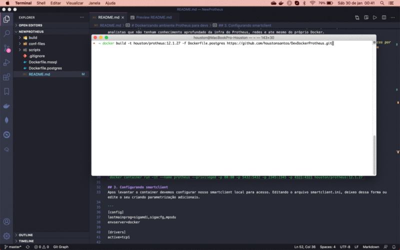

# Dockerizando ambiente Protheus para devs

Projeto consiste na criação de um container Docker do ERP Protheus 12.1.27 com dicioário de dados no banco de dados, usando Postgresql ou MSSQL 2017. Após build e execução do container, teremos uma única imagem com um único container, levantando o serviço de Banco, DBAccess, Licenserver e Appserver. A ideia é levantar um ambiente de testes do ERP e para desenvolvimento e estudo, rápido e prático para desenvolvedores e analistas que não tenham conhecimento aprofundado da infra do Protheus, redes e ate mesmo do próprio Docker.

>OBS: Este senário em hipótese nenhuma deve ser utilizado em ambientes de produção, pois a finalidade do Docker e termos processos únicos por containers, podendo ter exeções em alguns casos. Para hambientes de produção o indicado e usar o **Docker Compose** ou **Compose file com Swarm**, criando um Cluster Swarm.

## Versões dos binários utilizados

20-10-16-BRA-MENUS_12_1_27

20-10-16-BRA-HELPS_COMPL_12_1_27

20-10-16-BRA-DICIONARIOS_COMPL_12_1_27

20-11-13-DBACCESS_LINUX_X64_BUILD-20200606.TAR

20-12-14-P12_APPSERVER_BUILD-19.3.1.4_LINUX_X64.TAR

20-10-16-REPOSITORIO_DE_OBJETOS_BRASIL_12_1_27_TTTP120.RPO

## 1. Build do projeto

### POSTGRESQL
`docker build -t houston/protheus:12.1.27 -f Dockerfile.postgres https://github.com/houstonsantos/DevDockerProtheus.git`

### MSSQL 
`docker build -t houston/protheus:12.1.27 -f Dockerfile.mssql https://github.com/houstonsantos/DevDockerProtheus.git`

## 2. Levantando container
`docker container run -it --name protheus --privileged -p 80:80 -p 5432:5432 -p 2345:2345 -p 4321:4321 houston/protheus:12.1.27`

## 3. Configurando smartclient
Apos levantar o container devemos configurar nosso smartclient local para acesso. Editando o arquivo smartclient.ini, deixeo dessa forma ou edite o seu criando parametrização adicionais.

```
[config]
lastmainprog=sigamdi,sigacfg,mpsdu
envserver=docker

[drivers]
active=tcp1

[tcp1]
server=localhost
port=2345
```

Porta | Descrição
:------: | :---------------:
80 | Servidor HTTP http://localhost
2345 | Appserver
4321 | WebApp http://localhost:4321

# Resultado

<p align="center">
    
</p>