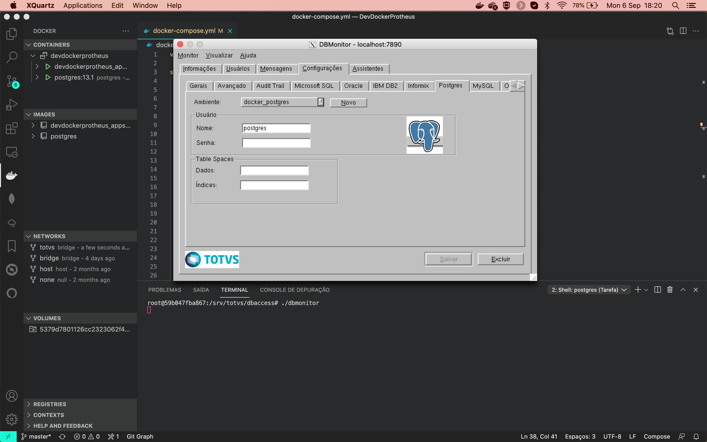

# Dockerizando ambiente Protheus para devs

Projeto consiste na criação de dois container Docker um do Appserver do Protheus 12.1.27 e do Licenserver e o segundo com Banco de dados (Postgres ou MSSQL) e DBAccess com dicioário de dados no banco de dados. A ideia é levantar um ambiente de testes do ERP e para desenvolvimento e estudo, rápido e prático para desenvolvedores e analistas que não tenham conhecimento aprofundado da infra do Protheus, redes e ate mesmo do próprio Docker.

>OBS: Este senário em hipótese nenhuma deve ser utilizado em ambientes de produção, pois a finalidade do Docker e termos processos únicos por containers, podendo ter exeções em alguns casos. Para ambientes de produção o indicado e usar o **Docker Compose** com Swarm**, criando um Cluster Swarm.

## Versões dos binários utilizados

20-10-16-BRA-MENUS_12_1_27

20-10-16-BRA-HELPS_COMPL_12_1_27

20-10-16-BRA-DICIONARIOS_COMPL_12_1_27

20-11-13-DBACCESS_LINUX_X64_BUILD-20200606.TAR

20-12-14-P12_APPSERVER_BUILD-19.3.1.4_LINUX_X64.TAR

20-10-16-REPOSITORIO_DE_OBJETOS_BRASIL_12_1_27_TTTP120.RPO

>Seu projeto deve ficar com a estrutura abaixo, após descompactar e renomear as pastas.

```
.
├── README.md
├── build
│   ├── animation.gif
│   ├── mssql
│   │   ├── db_mssql.sh
│   │   ├── db_mssql.sql
│   │   └── entrypoint-mssql.sh
│   └── postgres
│       ├── db_postgres.sh
│       └── entrypoint-postgresql.sh
├── conf-files
│   ├── appserver.ini
│   ├── dbaccess.ini
│   ├── odbc.ini
│   └── odbcinst.ini
├── docker-compose.yml
├── dockerfiles
│   ├── dockerfile.appserver
│   ├── dockerfile.mssql
│   └── dockerfile.postgres
├── protheus
│   ├── appserver
│   ├── dbaccess
│   ├── dicionarios
│   ├── helps
│   ├── licenserver
│   ├── menus
│   ├── smartclient
│   └── tttp120.rpo
├── scripts
│   ├── entrypoint-appserver.sh
│   └── setup.sh
```

## 1. Build do projeto

### BANCO DE DADOS
`Dentro do arquivo docker-compose.yml você deve verificar o bando de dados de sua escolha deixando descomentado.`

### ARQUIVO .env 
`Neste arquivo na você deve especificar suas configurações do banco de dados e para o appserver.`

```
# APPSERVER
AMBIENTE=NOME_DO_AMBIENTE
TOPDATABASE=NOME_SGDB
TOPALIAS=NOME_DRIVER_ODBC

# BANCO DE DADOS
DATABASE=NOME_DATABASE
DB_PASSWORD=SENHA_BANCO
```

## 2. Levantando container
`docker compose up - O comomado irá realizar o build e subir os containers.`

## 3. Configurando smartclient
Após levantar os containers devemos configurar nosso smartclient local para acesso. Editando o arquivo smartclient.ini, deixeo dessa forma ou edite o seu criando parametrização adicionais.

```
[config]
lastmainprog=sigamdi,sigacfg,mpsdu
envserver=docker

[drivers]
active=tcp

[tcp]
server=localhost
port=2345
```

Porta | Descrição
:------: | :---------------:
80 | Servidor HTTP http://localhost
2345 | Appserver
4321 | WebApp http://localhost:4321

>WARNING: Caso tenha problemas com alguna configuração do dbaccess você pode utilizar o dbmoniotr, a variável de ambiente DISPLAY redireciona a saída de vídeo do container para o host, para isso você precisa ter um servidor de vídeo instalado. Meu host é um Mac OS então usei o xQuartz, depois de instalar você deve abrir o terminal e digitar o comando xhost + 127.0.0.1, depois disso basta executar o dbmonitor.

<p align="center">
    
</p>


# Resultado

<p align="center">
    
</p>
teste